

## Applying Forensic Accounting Techniques
### Using SQL And R

<a href="https://www.catallaxyservices.com">Kevin Feasel</a> (<a href="https://twitter.com/feaselkl">@feaselkl</a>)
<a href="https://csmore.info/on/outliers">https://CSmore.info/on/outliers</a>

---

@title[Who Am I?]

@snap[west splitscreen]
<table>
	<tr>
		<td></td>
		<td><a href="https://csmore.info">Catallaxy Services</a></td>
	</tr>
	<tr>
		<td></td>
		<td><a href="https://curatedsql.com">Curated SQL</a></td>
	</tr>
	<tr>
		<td></td>
		<td><a href="https://wespeaklinux.com">We Speak Linux</a></td>
	</tr>
</table>
@snapend

@snap[east splitscreen]

	
	 
	<a href="https://www.twitter.com/feaselkl">@feaselkl</a>

@snapend

---

### A Case Study

@div[left-50]
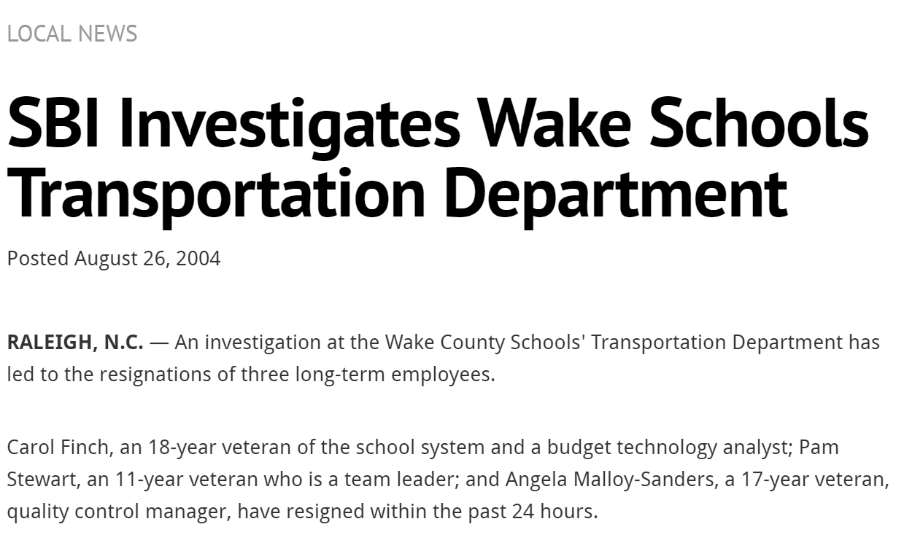
@divend

@div[right-50]
Transportation fraud

Wake County, North Carolina
@divend

---

### A Case Study -- A Quick Story

@div[left-50]
An auto parts company, working in conjunction with several county employees, defrauded Wake County of at least $5 million over a multi-year period.
@divend

@div[right-50]
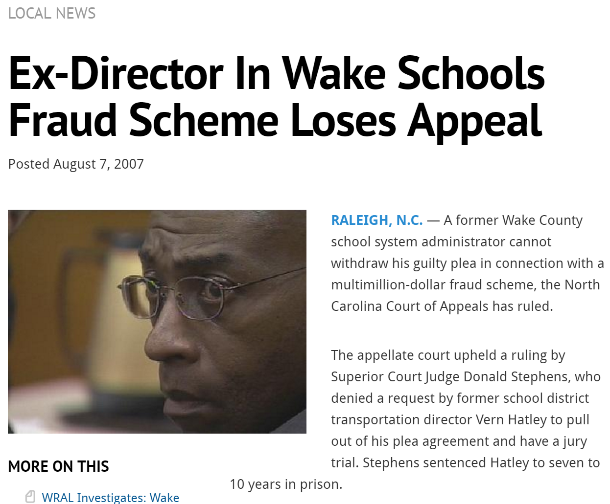
@divend

---

### A Case Study -- A Quick Story

@div[left-50]
In the end, several participants pled guilty and served jail time. 
@divend

@div[right-50]
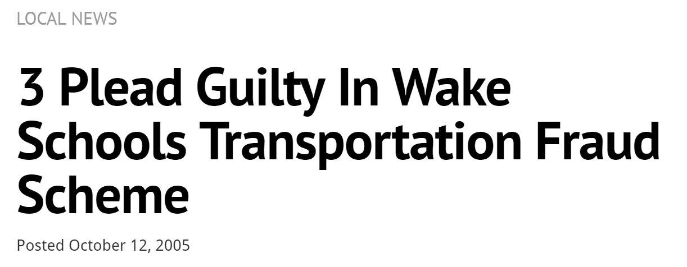
@divend

---

### A Case Study -- A Quick Story

@div[left-50]
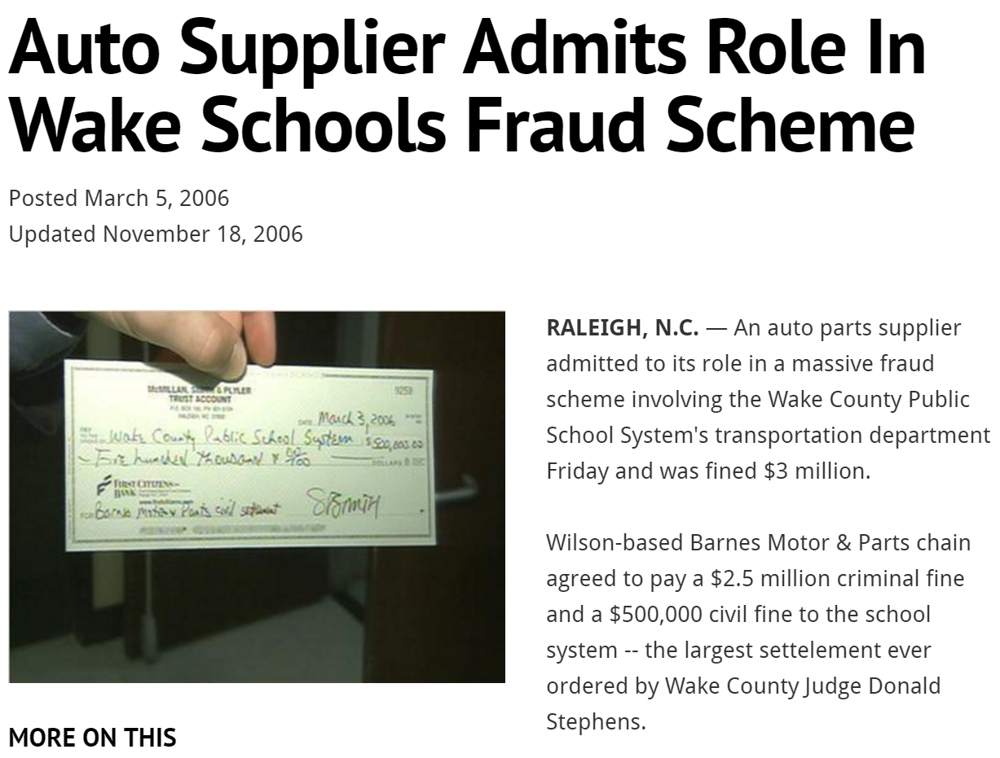
@divend

@div[right-50]
Wake County was able to claw back $5 million and Barnes Motor & Parts paid back $3 million, including a $2.5 million criminal fine.
@divend

---?image=presentation/assets/background/library.jpg&size=cover&opacity=20

### A Case Study --- A Quick Story

As we go over techniques forensic accountants use to find potentially fraudulent data, we will return to this case several times.

We will cover some of the techniques forensic accounts used to break this case, as well as gain an understanding of why it took so long.

---?image=presentation/assets/background/motivation.jpg&size=cover&opacity=20

### Motivation

Most of us don't spend time hunting down fraudsters using our data. But the practices and principles these forensic accountants use can still be valuable for us.

Ultimately, these techniques come down to knowing your data.  "Know your data" is something you hear in a lot of talks, and this talk will go into great detail on what that actually means.

---

@title[Know Your Data]

## Agenda

1. **Know Your Data**
2. Basic Analysis
3. Cohort Analysis
4. Time Series Analysis
5. Numeral Analysis

---

### Know Your Data

In today’s talk, we will use a simplified version of the Wake County fraud case.  **This is all fake data.**

Fake data lets us understand the key principles without getting lost in hundreds of tables.

---

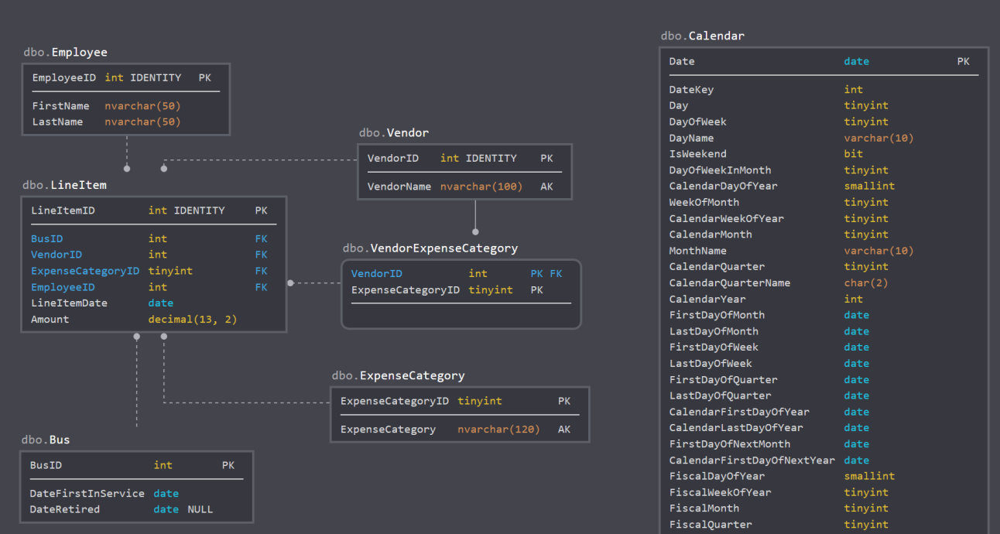

---?image=presentation/assets/background/audit.jpg&size=cover&opacity=20

### Know Your Data -- The Scenario

You work for a company which specializes in external audits of government agencies.  Your latest assignment is to review a county transportation agency.

All we have going in is a data model and a login with read-only access.  Let’s see where we can go.

---

@title[Basic Analysis]

## Agenda

1. Know Your Data
2. **Basic Analysis**
3. Cohort Analysis
4. Time Series Analysis
5. Numeral Analysis

---?image=presentation/assets/background/folders.jpg&size=cover&opacity=20

### Basic Analysis

Our basic analysis will focus on a few important areas:

* Summary Analysis
* Growth Analysis
* Gaps In Data
* Regression Analysis

---?image=presentation/assets/background/aerial-water.jpg&size=cover&opacity=20

### Summary Analysis

Summary analysis looks at things like row counts, data types, and keys.

In SQL Server, here is some of what I do to learn about a new database.

---

### Step 1:  Review Large Tables

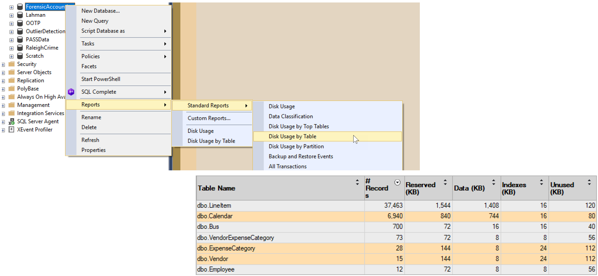

---

### Step 2:  Review a Large Table

@div[left-50]
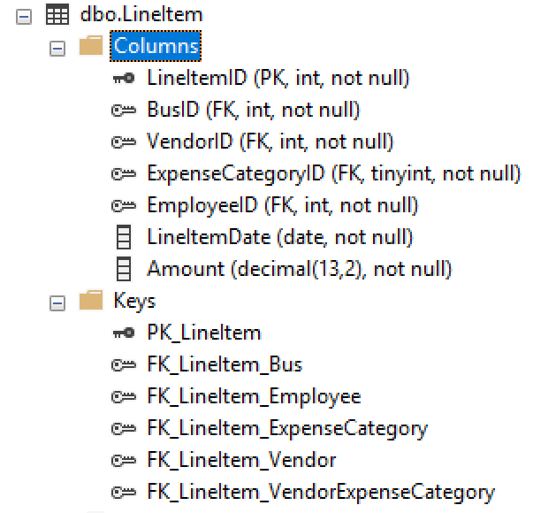
@divend

@div[right-50]
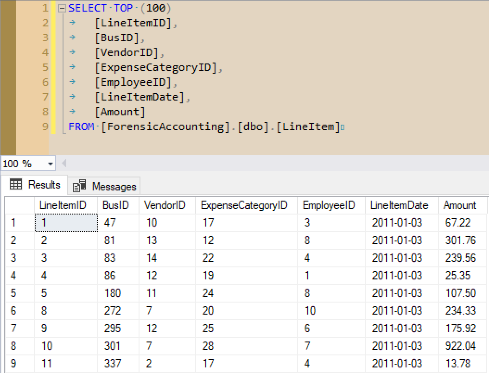
@divend

---

### Step 3:  Recursively Review FKs

@div[left-50]
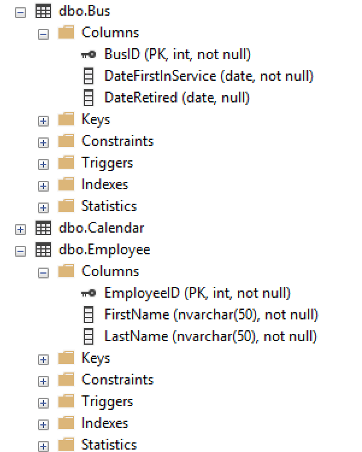
@divend

@div[right-50]
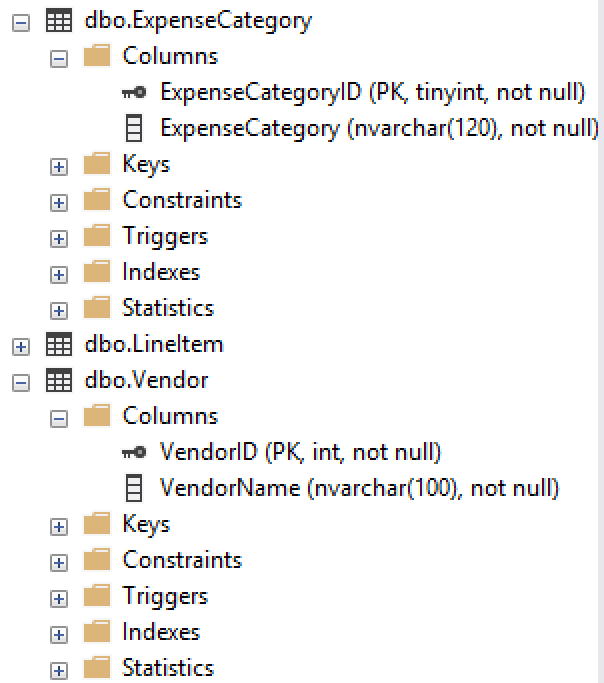
@divend

---

### Step 4:  Rinse and Repeat

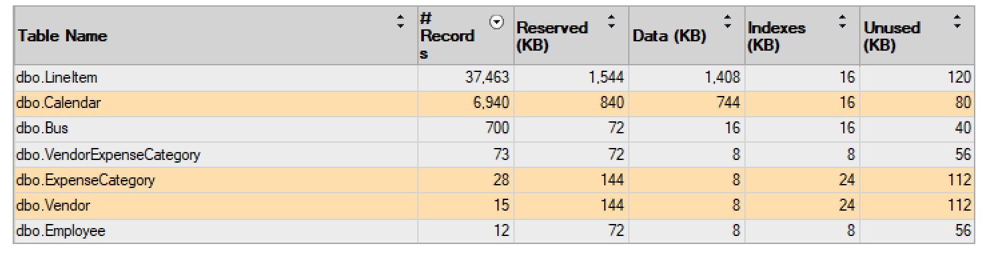

We’ve yet to see `Calendar`, so that might be our next stop.  Or maybe `VendorExpenseCategory`.

---

### Summary Analysis

Creating a database diagram is also helpful here if you don’t have one.

---?image=presentation/assets/background/aerial-water.jpg&size=cover&opacity=20

### Growth Analysis

Growth analysis looks at changes in ratios over time. Our goal is to look for major changes which look to be far outside the norm.

Typically, we will perform growth analysis against important additive measures: company growth, revenue, cost, number of customers, etc.

---?image=presentation/assets/background/demo.jpg&size=cover&opacity=20

### Demo Time

---?image=presentation/assets/background/sinkhole.jpg&size=cover&opacity=20

### Gap Analysis

Sometimes, it's the **lack** of a value which is interesting. We want to look for sequences which should be complete but aren't--examples include receipts, purchase orders, check numbers, invoice numbers, etc.

There are several T-SQL constructs which can help us find missing values, including the Gaps and Islands solutions and using a tally table.

---?image=presentation/assets/background/demo.jpg&size=cover&opacity=20

### Demo Time

---?image=presentation/assets/background/surfer-crash.jpg&size=cover&opacity=20

### Gap Analysis

**Warning:** if you generate invoice numbers (for example) using a SQL Server identity integer, gaps may occur when transactions get rolled back. It may be better to use a surrogate key for storage but generate an invoice number only after the new transaction saves successfully.

---?image=presentation/assets/background/notebook.jpg&size=cover&opacity=20

### Regression Analysis

What we have:
* A dependent variable:  the thing whose behavior we want to explain.
* Independent variables:  the things whose behavior explains the dependent variable.
* Known data points relating our independent variable(s) to our dependent variable.

Regression analysis can get complicated, but if you know what the data "ought" to look like, regression can help you confirm or disprove your conjecture.

---

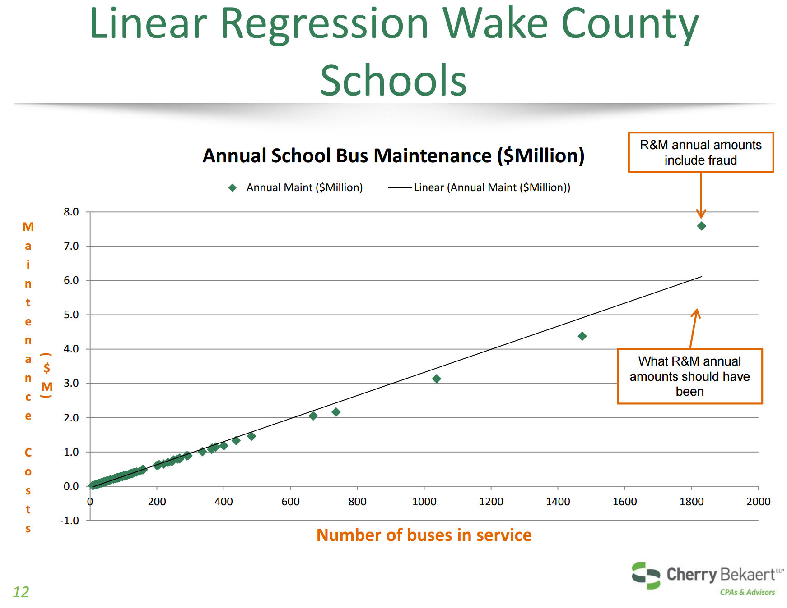

---?image=presentation/assets/background/demo.jpg&size=cover&opacity=20

### Demo Time

---

@title[Cohort Analysis]

## Agenda

1. Know Your Data
2. Basic Analysis
3. **Cohort Analysis**
4. Time Series Analysis
5. Numeral Analysis

---?image=presentation/assets/background/slices.jpg&size=cover&opacity=20

### Cohort Analysis

Looking at top-level aggregates or a single slice (customer, vendor, group) might help us find problems, and looking at a broad-based comparison of these slices may give us a clearer picture.

A data set can be sliced many ways, so there could be a large number of relevant cohorts.

---?image=presentation/assets/background/cardinal.jpg&size=cover&opacity=20

### Duplicates and Cardinality

Look for duplicates along two angles.

First, one-time codes or unenforced unique keys can show where the same data shows up multiple times.

Second, things which are very close but not quite the same, like typos (e.g., “Fundation” instead of “Foundation”).

---?image=presentation/assets/background/engineering.jpg&size=cover&opacity=20

### Duplicates and Cardinality

There are several measures for the similarity of two text phrases, including Levenshtein distance, soundex, and even pattern matching using LIKE. Depending upon the level of sophistication necessary, getting the similarity of two items based on text descriptors can take quite a bit of effort!

---?image=presentation/assets/background/duplicates.jpg&size=cover&opacity=20

### Duplicates and Cardinality

Tying back to the Wake County fraud case, there were 24 separate days in which the auto supplier submitted **50+** invoices under $2500 to the county. Here, the duplication is in vendor and date and is well outside the expected behavior for a vendor on the up-and-up.

---?image=presentation/assets/background/demo.jpg&size=cover&opacity=20

### Demo Time

---

### Difference Analysis

When comparing different members of a cohort, remember that there are two types of difference: differences between groups and differences within a group.

Differences between groups may indicate suspicious behavior if one member of the group acts well outside the norm, such as in the number of invoices submitted per day.

Looking at differences within a group can help explain anomalous aggregate behavior.

---

### Box Plots

Box plots are valuable for comparing cohorts.

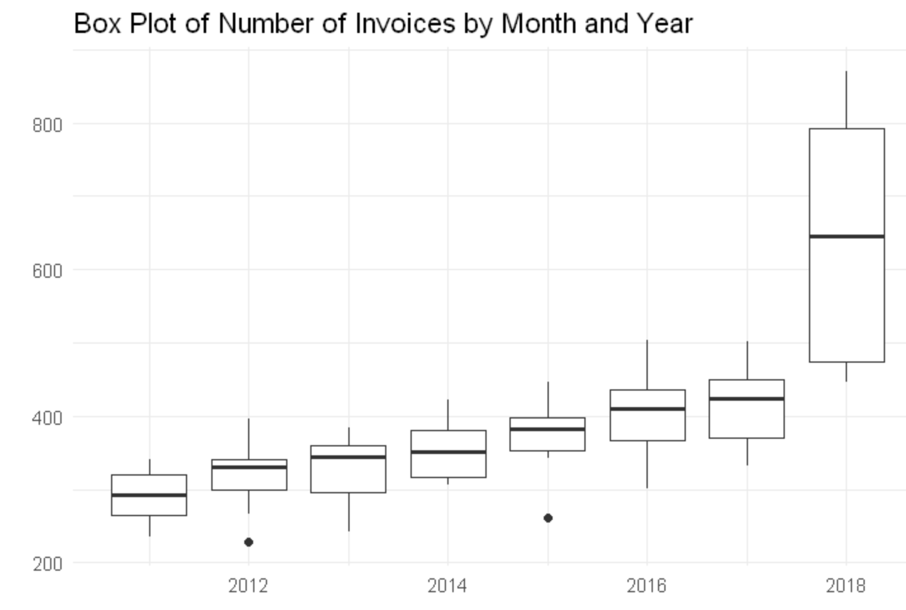

---?image=presentation/assets/background/outlier.jpg&size=cover&opacity=20

### Outliers

Plotting a trend and looking for outliers (defined either in a technical sense or in the general sense of "well outside the norm") can dig up strange behavior. Real data sets will always have outliers, though, so the existence of outliers is not in itself suspicious.

---?image=presentation/assets/background/clusters.jpg&size=cover&opacity=20

### Clustering Behavior

Something interesting when analyzing a cohort is to look for clustering around certain values. Examples: expense reports and invoices.

Going back to our Wake County example, there was a cluster around $2500, as that was the cutoff point after which a second person needed to sign off on a payment order.

In our example, our cutoff point will be $1000, after which employees need two signatures to complete an invoice.

---?image=presentation/assets/background/demo.jpg&size=cover&opacity=20

### Demo Time

---

@title[Time Series Analysis]

## Agenda

1. Know Your Data
2. Basic Analysis
3. Cohort Analysis
4. **Time Series Analysis**
5. Numeral Analysis

---?image=presentation/assets/background/time.jpg&size=cover&opacity=20

### Simple Time Series

The easiest time series analysis is a count of items per day.

Going back to the Wake County example, auditors could have found something suspicious with the Barnes company pretty easily: there were 24 separate days with at least 50 invoices, certainly a suspicious scenario.

Other time series examples include the sums of measures by day or month, such as revenue, cost, number of orders, and amounts of refunds.

---?image=presentation/assets/background/balance.jpg&size=cover&opacity=20

### Balances

For semi-additive measures such as account balances, look at the state of the measure at fixed points in time, such as looking at account balances every day at 9 PM UTC.

---?image=presentation/assets/background/calendar.jpg&size=cover&opacity=20

### Date Checks

Look for "odd" date combinations: order date later than ship date? Adjustments after a journal closes?

Look at behavior based on date: focus on day of week, day of month, weekdays vs weekends, mid-week versus early week vs late week. Sum and count measures grouped on these date slices.

---?image=presentation/assets/background/holiday.jpg&size=cover&opacity=20

### Holidays

Holidays can lead to different behavior like more sales of higher amounts. They can also lead to less activity, like how when invoices are due on a holiday, they may be submitted the next working day.

Be aware of floating holidays like Easter, as well as observed holidays like Christmas Day observed. It's easiest to store holidays in a date table to avoid trying to calculate these rules on the fly.

---

@title[Numeral Analysis]

## Agenda

1. Know Your Data
2. Basic Analysis
3. Cohort Analysis
4. Time Series Analysis
5. **Numeral Analysis**

---?image=presentation/assets/background/polyhedron2.jpg&size=cover&opacity=20

### Round Numbers

One high-level analysis of values is to get a count of "round numbers." We group into types based on the number of 0s at the end (ignoring cents): $5000 (type 3), $10,200 (type 2), $180 (type 1), $17,999 (type 0).

---?image=presentation/assets/background/demo.jpg&size=cover&opacity=20

### Demo Time

---

### Benford's Law

@div[left-50]
Benford's Law is an interesting phenomenon, where the first digit (or two digits, or three digits) of a set of numbers tends to follow a specific pattern.
@divend

@div[right-50]
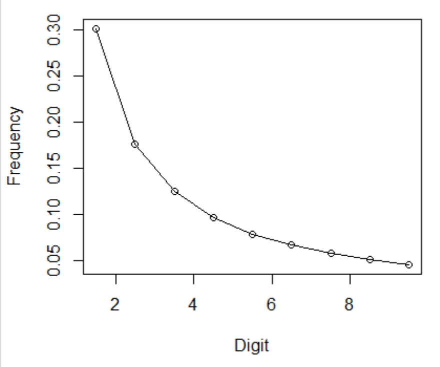
@divend

---?image=presentation/assets/background/demo.jpg&size=cover&opacity=20

### Demo Time

---

### Last Digits

Last digits are assumed uniform unless there is a reason to believe otherwise.

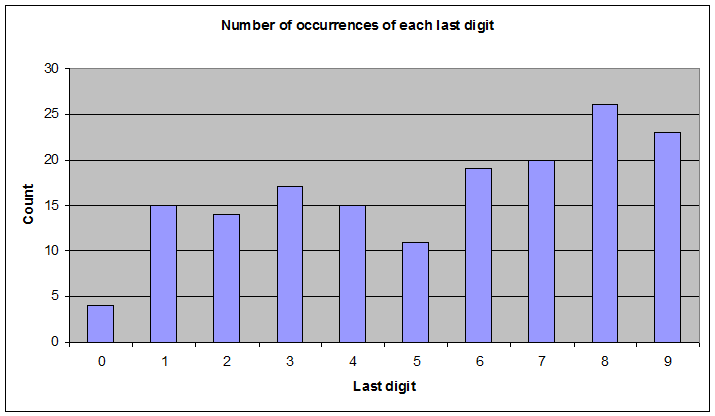

---?image=presentation/assets/background/wrappingup.jpg&size=cover&opacity=20

@title[Wrapping Up]

### Wrapping Up

This has been a quick survey of forensic accounting and outlier detection techniques. You can apply these techniques to a number of data sets, not only to find potential instances of fraud but also to gain more insight into your data.

---

### Wrapping Up

To learn more, go here:  <a href="https://csmore.info/on/outliers">https://CSmore.info/on/outliers</a>

And for help, contact me:  <a href="mailto:feasel@catallaxyservices.com">feasel@catallaxyservices.com</a> | <a href="https://www.twitter.com/feaselkl">@feaselkl</a>
